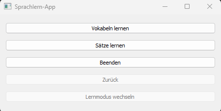

# Sprachlern-App

## Beschreibung
Die Sprachlern-App ist ein einfaches Python-Programm, das dazu dient, Vokabeln in einer Fremdsprache zu lernen und zu üben. Die App ermöglicht es, Vokabeln zu lernen, Sätze zu lernen, neue Vokabeln und Sätze hinzuzufügen sowie den Lernprozess individuell anzupassen. Vorerst wird nur Deutsch / Englisch unterstützt!

## Inhaltsverzeichnis
- [Verwendung](#verwendung)
- [Funktionen](#funktionen)
  - [Lernmodus](#lernmodus)
  - [Zurück-Button](#zurück-button)
  - [Beenden-Button](#beenden-button)
- [Anpassung des Vokabulars](#anpassung-des-vokabulars)
- [Tastenkürzel](#tastenkürzel)
- [100 Days of Code Techstarter](#100-days-of-code-techstarter)
- [Lizenz](#license)
- [Previews](#previews)

## Verwendung
Um die Sprachlern-App zu verwenden, folge diesen Schritten:

1. Stelle sicher, dass du Python auf deinem Computer installiert hast.
2. Lade die Datei `app.py` und die erforderliche SQLite-Datenbankdatei herunter und speichere sie im selben Verzeichnis.
3. Öffne ein Terminal oder eine Kommandozeile und navigiere zum Verzeichnis, in dem die Dateien gespeichert sind.
4. Führe das Programm aus, indem du den Befehl `python app.py` eingibst.

## Funktionen
Die Sprachlern-App bietet die folgenden Funktionen:

### Lernmodus
- **Vokabeln lernen**: Du kannst den Lernmodus für Vokabeln starten, in dem dir zufällige Vokabeln angezeigt werden. Du wirst aufgefordert, die Übersetzung des gezeigten Wortes einzugeben. Wenn deine Eingabe korrekt ist, erhältst du eine Bestätigung. Andernfalls wird dir die richtige Übersetzung angezeigt.

- **Sätze lernen**: Du kannst den Lernmodus für Sätze starten, in dem dir zufällige Sätze angezeigt werden. Du wirst aufgefordert, die Übersetzung des gezeigten Satzes einzugeben. Wenn deine Eingabe korrekt ist, erhältst du eine Bestätigung. Andernfalls wird dir die richtige Übersetzung angezeigt.

**Statistiken Anzeigen**: Du kannst dir eine kleine Statistik anzeigen lassen über die gelernten Wörter/Sätze. Diese Funktion ermöglicht es dir, den Fortschritt deines Lernprozesses zu verfolgen. Die Statistik beinhaltet Informationen zu:

- **Gelernte Einheiten**: Die Anzahl der gelernten Wörter oder Sätze.
- **Korrekte Antworten**: Die Anzahl der korrekt beantworteten Fragen oder Übungen.
- **Fehlerhafte Antworten**: Die Anzahl der fehlerhaften Antworten oder falsch beantworteten Fragen.

Mit diesen Funktionen kannst du deine Lernfortschritte verfolgen und die Statistiken visualisieren, um dein Lernverhalten besser zu verstehen.

### Zurück-Button
- **Zurück-Button**: Du kannst den Zurück-Button verwenden, um zwischen dem Lernen von Vokabeln und dem Lernen von Sätzen zu wechseln. Dies ermöglicht es dir, deine Lernmethode anzupassen und flexibel zwischen den Modi zu wechseln.

### Beenden-Button
- **Beenden-Button**: Du kannst das Programm jederzeit beenden, indem du die entsprechende Option auswählst.

## Anpassung des Vokabulars
Das Vokabular wird in einer SQLite-Datenbankdatei gespeichert. Du kannst diese Datenbankdatei bearbeiten, um das Vokabular anzupassen. Füge einfach neue Vokabeln oder Sätze hinzu oder ändere bestehende Übersetzungen direkt in der Datenbank.

## Tastenkürzel
Die Sprachlern-App unterstützt Tastenkürzel für eine schnellere Bedienung:
- Drücke `Enter`, um die Eingabe zu überprüfen.
- Drücke `F2`, um das nächste Element zu laden.

## 100 Days of Code Techstarter
Dieses Projekt wurde als Teil des "100 Days of Code Techstarter" entwickelt. Es dient dazu, meine Programmierfähigkeiten zu verbessern und kontinuierlich an Projekten zu arbeiten.

## Lizenz
Dieses Projekt ist lizenziert unter der [MIT License](LICENSE).

## Previews

    

**Viel Spaß beim Lernen mit der Sprachlern-App!**

